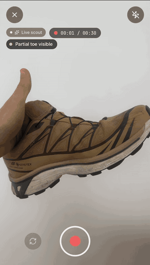

# Tread

Point a phone at a running shoe and find out how worn it is. A prototype of one
moment: the camera, with Claude vision doing the looking.



Live scout on an iPhone, sped up.

## What happens

1. **While you frame the shoe**, a frame goes to Claude every few seconds and
   short findings appear over the viewfinder ("Heel rubber smooth"). One call
   is ever in flight, and polling stops when the tab is hidden.
2. **You take four photos** or a short video. For video, one still is pulled
   from the clip.
3. **Claude scores four zones** (heel, forefoot, midsole, upper) through a tool
   schema. Each zone comes back with the photo it was seen in and a box around
   where, so the result draws on your own photos rather than a stock diagram.

## Only what it can see

The app never shows a shoe name it guessed. Claude has to quote the text it can
read on the shoe first, and the code drops any brand or model that is not in
that quote, whatever the prompt said. A logo or tread pattern is not enough.
No readable text means "Unidentified shoe".

Photos with no shoe in them get no score, just what Claude saw instead. Zones
it cannot see score 60 and say so, and the live scout is told that an empty
answer is a valid one.

## Run it

```
pnpm install
cp .env.local.example .env.local   # paste an Anthropic API key
pnpm dev                           # https://localhost:5180
```

The camera needs a secure context, so the dev server uses a self-signed
certificate. Open the LAN URL on a phone and accept it once. Without a camera,
the app falls back to a photo upload.

The API key ships to the browser. That is fine on your own network and wrong
for anything deployed, where the call belongs behind a server.

## Where things live

```
src/app/screens/   Scan, Processing, ScanResult
src/lib/camera/    stream, capture, recording, torch
src/lib/vision/    live scout, full analysis, identification guard, image prep
```

Vite, React 19, TypeScript strict, Tailwind 4, Zustand, Framer Motion.
